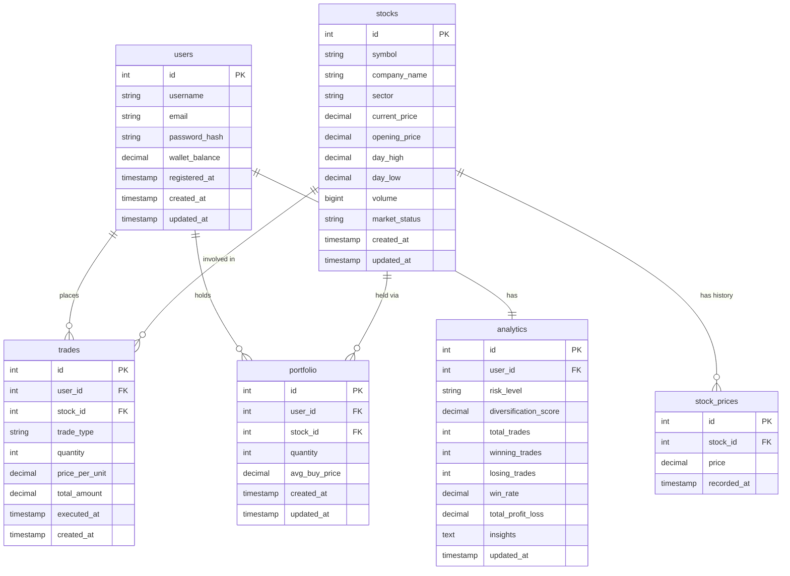

# ER Diagram

The database has 6 core tables. `users` holds accounts and wallet balance. `stocks` holds simulated market data. `trades` is an immutable log of every buy/sell. `portfolio` tracks live holdings per user per stock (upserted on every trade). `stock_prices` stores historical snapshots for charts. `analytics` is a computed summary per user, refreshed after trades.

