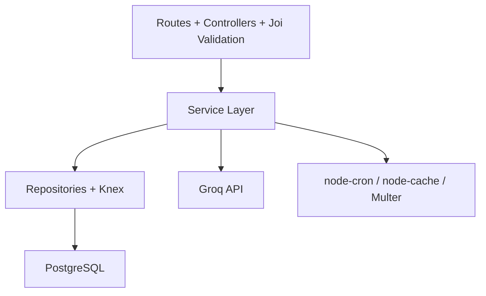
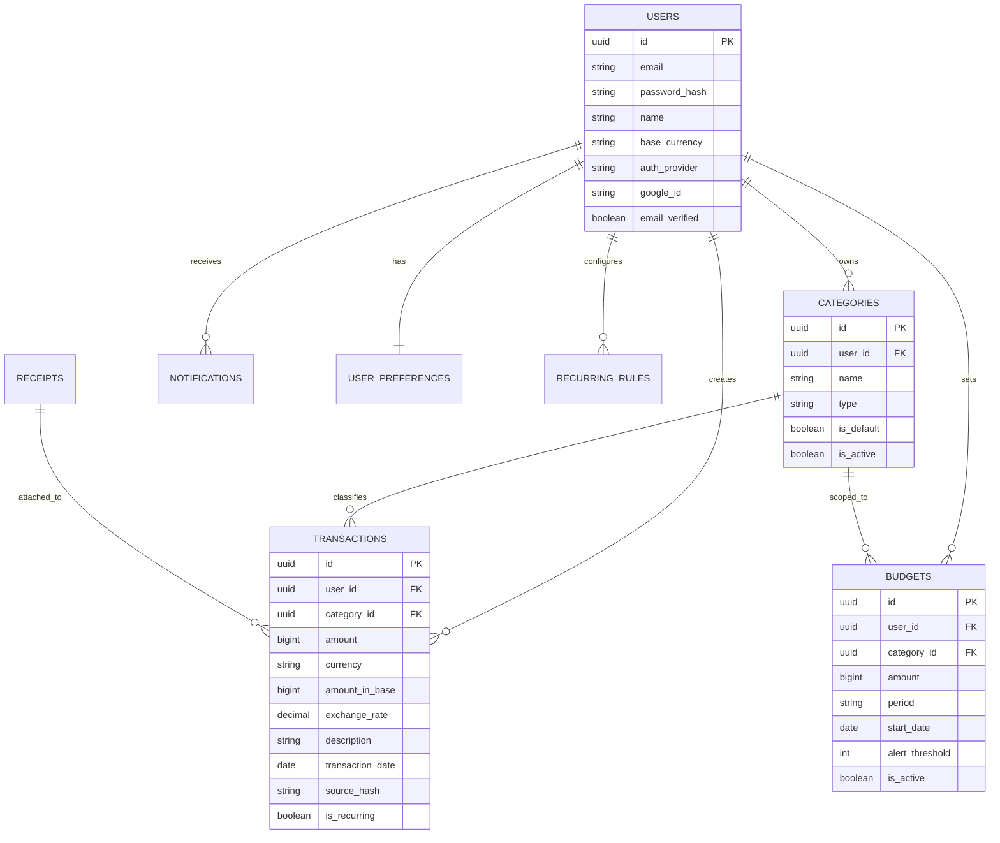
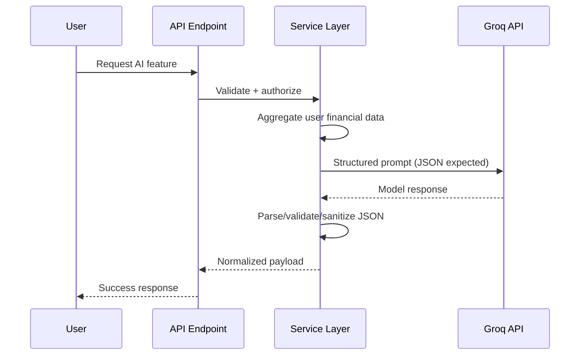

# FinanceAI

A personal finance tracker built with Node.js + Express + PostgreSQL and a React frontend. It handles the usual transaction/budget/report stuff but also has an AI layer (Groq API, llama-3.3-70b-versatile) for insights, anomaly detection, and a conversational finance assistant.

> Demo account pre-seeded with 6 months of transactions, budgets, and recurring rules.
> Login: `demo@financetracker.com` / `Demo@1234`

## Table of Contents

- [Features](#features)
- [Architecture](#architecture)
- [Tech Stack](#tech-stack)
- [Database Schema](#database-schema)
- [AI Integration](#ai-integration)
- [Notable Implementation Details](#notable-implementation-details)
- [API Overview](#api-overview)
- [Getting Started](#getting-started)
- [Environment Variables](#environment-variables)
- [Running Tests](#running-tests)
- [Project Structure](#project-structure)

---

## Features

### Core Finance
| Feature | Details |
|---|---|
| **Transaction Management** | Full CRUD, cursor-based pagination, filtering by date/category/type/tags/amount |
| **Bulk Operations** | Bulk delete, bulk re-categorize across multiple transactions |
| **Categories** | Custom categories with icon/color, default seeding on registration, soft delete |
| **Category Merge** | Merge one category into another — all transactions reassigned, no data loss |
| **Budgets** | Per-category or overall budgets (weekly/monthly/yearly) with progress tracking |
| **Budget Alerts** | Configurable alert thresholds (default 80%), background job checks hourly |
| **Reports** | Monthly summary, category breakdown, year-over-year, savings trend, CSV export |
| **Receipt Uploads** | Attach receipts to transactions; local storage in dev, S3-compatible in prod |
| **Recurring Transactions** | Rules engine — daily cron auto-creates salary, rent, subscription transactions |
| **Multi-Currency** | Per-transaction currency with live exchange rate conversion to base currency |
| **Notifications** | In-app notification center with unread count and mark-read |

### AI Features (Powered by Groq)
| Feature | Endpoint | Description |
|---|---|---|
| **Finance Assistant** | `POST /chat/message` | Conversational AI with full chat history, answers questions about your real data |
| **Smart Insights** | `GET /insights/generate` | 3 actionable insights from 3 months of spending, cached 24 hours |
| **Anomaly Scanner** | `GET /ai/anomalies` | Detects unusual transactions vs 3-month historical baseline |
| **Budget Advisor** | `GET /ai/budget-recommendations` | AI-suggested per-category budgets based on spending patterns |
| **Goal Planner** | `POST /ai/goal-plan` | Personalised savings plan with monthly timeline and cut-down actions |

### Production Readiness
- JWT auth with refresh tokens + automatic rotation
- Google OAuth (passport-google-oauth20) — gracefully disabled when credentials absent
- Rate limiting: 10 req/15min on auth, 100 req/15min on API
- Helmet security headers, CORS configured per environment
- Structured JSON logging (Winston)
- Background jobs: budget alerts, recurring transactions (node-cron)
- Dashboard caching with node-cache (60s TTL, auto-invalidated on mutations)
- Integration tests: Jest + Supertest against isolated test database

---

## Architecture



Feature-based modules — each module owns its routes, controller, service, repository, and validation. Shared utilities (error classes, money helpers, Groq client, logger) live in `src/shared/`.

---

## Tech Stack

| Layer | Technology |
|---|---|
| **Runtime** | Node.js 18+ |
| **Framework** | Express 5 |
| **Database** | PostgreSQL 14+ |
| **Query builder** | Knex.js |
| **Auth** | JWT (jsonwebtoken) + Passport.js (Google OAuth) |
| **AI** | Groq API — llama-3.3-70b-versatile |
| **Validation** | Joi |
| **File uploads** | Multer + Sharp (thumbnails) |
| **Background jobs** | node-cron |
| **Caching** | node-cache |
| **Logging** | Winston |
| **Testing** | Jest + Supertest |
| **Frontend** | React 18 + Vite + Recharts |

---

## Database Schema

Money is stored as **BIGINT in smallest currency unit** (paise/cents) — no floats, no rounding errors.



**Indexes on transactions:** `(user_id, transaction_date DESC)`, `(user_id, category_id)`, `(user_id, type, transaction_date)`, GIN on `tags`, GIN trgm on `description` (fuzzy search).

---

## AI Integration

All AI features call the Groq API through a shared `groqClient` utility (`src/shared/utils/groqClient.js`).

- **Model:** `llama-3.3-70b-versatile`
- **Structured output:** every AI call requests JSON; markdown fences are stripped before parsing
- **Rate limiting:** AI endpoints are capped at 10 requests/hour per user
- **Caching:** insights are cached per user for 24 hours (node-cache)
- **Data privacy:** only aggregated summaries (totals, category names, averages) reach the API — no raw transaction IDs or personal identifiers



---

## Notable Implementation Details

**Cursor-based pagination** — transaction list uses opaque `next_cursor` tokens instead of offset. No duplicate or skipped rows if writes happen between pages.

**Money as integers** — every amount is BIGINT (paise/cents). Conversion to display decimals only happens at the API boundary. No floats stored anywhere.

**Soft deletes + category merge** — deleting a category sets `is_active = false`, not a hard delete. Existing transactions keep their FK so historical reports stay accurate. The merge endpoint reassigns all transactions before deactivating the source category.

**Recurring transactions engine** — `recurring_rules` stores a JSONB template per rule. A daily cron job checks `next_occurrence <= TODAY`, creates the transaction from the template, and advances the date forward.

**Financial health score** — the dashboard computes a 0–100 score using a weighted formula: savings rate (40%), budget adherence (30%), expense diversity (15%), income consistency (15%). Per-dimension breakdown is included in the response.

**SQL-first aggregations** — monthly reports use `generate_series()` to fill zero-value months so the chart never has gaps. The dashboard endpoint (BFF pattern) runs all queries in parallel and returns a single composite payload.

**Exchange rate snapshots** — each transaction stores `exchange_rate` and `amount_in_base` at write time. Reports always use the stored snapshot, never a live rate. Immutable audit trail.

**SHA-256 deduplication on import** — `source_hash` is computed from date + amount + description with a partial unique index per user. Re-importing the same bank statement won't create duplicate rows.

**pg_trgm fuzzy search** — GIN index on `description gin_trgm_ops` lets partial or misspelled description searches run without a full table scan.

---

## API Overview

All endpoints: `/api/v1/`. Response envelope:

```json
{ "success": true, "data": { ... } }
{ "success": false, "error": { "code": "VALIDATION_ERROR", "message": "...", "details": [...] } }
```

| Resource | Methods |
|---|---|
| `POST /auth/register` | Register with email + password |
| `POST /auth/login` | Login, returns JWT + refresh token |
| `POST /auth/refresh` | Rotate refresh token |
| `GET /auth/google` | Initiate Google OAuth (requires credentials) |
| `GET /transactions` | List with cursor pagination + filters |
| `POST /transactions` | Create (validates category ownership + type match) |
| `POST /transactions/bulk-delete` | Delete multiple |
| `POST /transactions/bulk-recategorize` | Re-categorize multiple |
| `GET /categories` | List with transaction counts |
| `POST /categories/:id/merge` | Merge into another category |
| `GET /budgets/summary` | All budgets with current spend progress |
| `GET /reports/monthly-summary` | Income/expense/savings per month (gap-filled) |
| `GET /reports/year-over-year` | 12-month comparison |
| `GET /reports/export` | CSV download |
| `GET /dashboard` | Composite BFF response |
| `POST /chat/message` | Conversational AI with history |
| `GET /insights/generate` | AI insights (cached 24h) |
| `GET /ai/anomalies` | Anomaly detection |
| `GET /ai/budget-recommendations` | AI budget suggestions |
| `POST /ai/goal-plan` | Savings plan for a goal |
| `POST /import/preview` | Parse bank CSV **or PDF**, preview rows with dedup flags |
| `POST /import/confirm` | Commit imported transactions |
| `GET /investments` | List all investments with P&L and portfolio summary |
| `POST /investments` | Add a stock / mutual fund / crypto holding |
| `PUT /investments/:id` | Update holding (e.g. refresh current price) |
| `DELETE /investments/:id` | Remove a holding |
| `POST /receipts` | Upload receipt (JPEG/PNG/PDF, max 5MB) |
| `GET /notifications` | List with unread count |

---

## Getting Started

### Prerequisites

- Node.js 18+
- PostgreSQL 14+
- Groq API key (free at [console.groq.com](https://console.groq.com))

### 1. Clone and install

```bash
git clone <repo-url>
cd <repo-folder>

cd backend && npm install
cd ../frontend && npm install
```

### 2. Create databases

```bash
createdb finance_tracker
createdb finance_tracker_test
```

### 3. Configure environment

```bash
cd backend
cp .env.example .env
# Set DB_USER, JWT_SECRET, JWT_REFRESH_SECRET, GROQ_API_KEY at minimum
```

### 4. Migrate and seed

```bash
cd backend
npm run migrate:up
npm run seed          # demo@financetracker.com / Demo@1234
```

### 5. Start

```bash
# Terminal 1 — backend (port 5001 — set PORT=5001 in .env)
cd backend && npm run dev

# Terminal 2 — frontend (port 3000)
cd frontend && npm run dev
```

---

## Environment Variables

| Variable | Required | Description |
|---|---|---|
| `DB_HOST` | Yes | PostgreSQL host |
| `DB_USER` | Yes | PostgreSQL user |
| `DB_NAME` | Yes | Database name |
| `JWT_SECRET` | Yes | Min 64 chars |
| `JWT_REFRESH_SECRET` | Yes | Min 64 chars |
| `GROQ_API_KEY` | Yes | All AI features |
| `GROQ_MODEL` | No | Default: llama-3.3-70b-versatile |
| `GOOGLE_CLIENT_ID` | No | OAuth — returns 503 if absent |
| `GOOGLE_CLIENT_SECRET` | No | OAuth |
| `EXCHANGE_RATE_API_KEY` | No | Live FX — falls back to last stored rate, then 1:1 |
| `STORAGE_TYPE` | No | `local` (default) or `s3` |

---

## Running Tests

```bash
cd backend
npm test                  # all tests
npm run test:coverage     # with coverage
```

Coverage includes:
- Auth: register, login, token refresh, protected route 401
- Transactions: CRUD, negative amounts, category type mismatch, cross-user 403
- Budgets: progress calculations, alert thresholds
- Categories: soft delete — transactions remain intact after deactivation

---

## Project Structure

```
backend/
├── src/
│   ├── config/          # Central config loader, DB setup, constants
│   ├── middleware/       # auth, validate, errorHandler, rateLimiter, upload
│   ├── modules/
│   │   ├── auth/        # routes · controller · service · repository · validation
│   │   ├── transactions/
│   │   ├── categories/
│   │   ├── budgets/
│   │   ├── reports/
│   │   ├── dashboard/
│   │   ├── notifications/
│   │   ├── receipts/
│   │   ├── insights/
│   │   ├── recurring/
│   │   ├── chat/
│   │   ├── import/      # CSV + PDF parse · preview · confirm · pdfParser.js
│   │   ├── investments/ # stock / mutual_fund / crypto CRUD + P&L service
│   │   └── ai/
│   ├── shared/
│   │   ├── errors/      # AppError, NotFoundError, BadRequestError, ...
│   │   └── utils/       # groqClient, money, dates, logger, response
│   ├── jobs/            # budgetAlertJob, recurringTransactionsJob
│   ├── app.js
│   └── server.js
├── migrations/          # Timestamped Knex migrations (up + down)
├── seeds/               # Demo user + 6 months of realistic data
└── tests/               # Jest + Supertest integration tests
    └── helpers/         # testDb setup, factories (createUser, createTransaction, ...)

frontend/
├── src/
│   ├── pages/           # 15 pages (Dashboard, Transactions, Budgets, Investments, Chat, ...)
│   ├── components/      # Layout (sidebar + topbar), Charts, PrivateRoute
│   ├── context/         # AuthContext — JWT storage + refresh
│   └── services/        # api.js — typed wrappers for every backend endpoint
```
