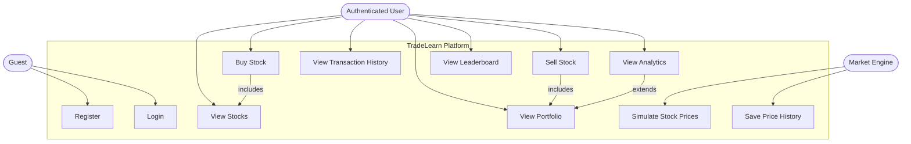
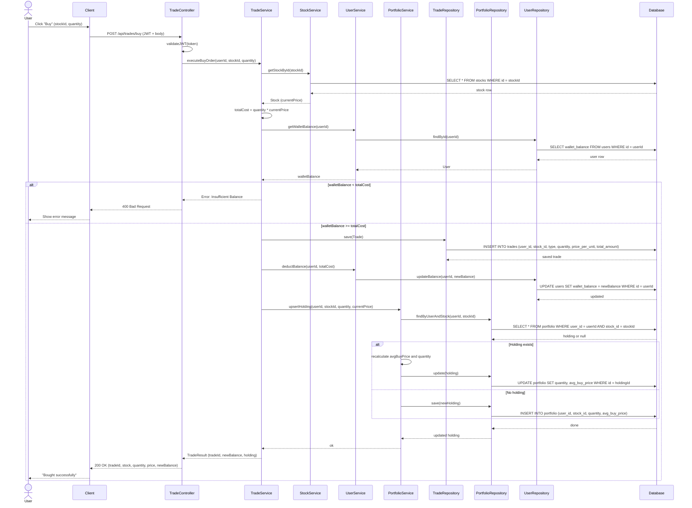
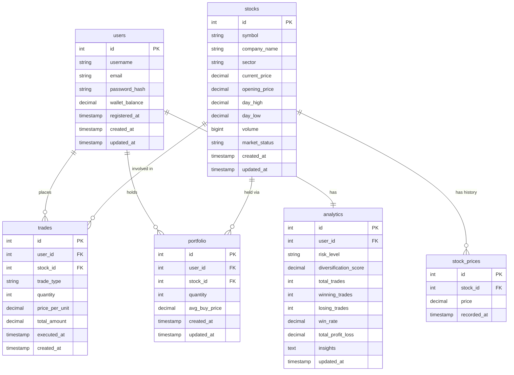

# TradeLearn – Virtual Stock Trading & Learning Platform

**Course:** Software Engineering and System Design (SESD) | **Type:** Full Stack Application

**TradeLearn** is a virtual stock trading platform where users practice buying and selling stocks using virtual money. There are no real APIs — stock prices are generated by an internal simulation engine. Users can track their portfolio, view P&L, and get personalized learning insights based on their trading behavior.

---

## Tech Stack

| Layer | Technology |
|---|---|
| Backend | TypeScript, Express.js |
| Database | PostgreSQL with Prisma ORM |
| Auth | JWT |
| Frontend | Next.js, Tailwind CSS |
| Charts | Chart.js / Recharts |

---

## Architecture

```
Controllers → Services → Repositories → Database
```

- **OOP:** Encapsulation, Abstraction, Inheritance, Polymorphism
- **Patterns:** Repository, Service Layer, Strategy (price simulation), Factory, DI

---

## Files

| File | Description |
|------|-------------|
| [`idea.md`](./idea.md) | Problem statement, scope, features, tech stack |
| [`useCaseDiagram.md`](./useCaseDiagram.md) | Actors and use cases |
| [`sequenceDiagram.md`](./sequenceDiagram.md) | Buy stock end-to-end flow |
| [`classDiagram.md`](./classDiagram.md) | Backend classes, methods, relationships |
| [`ErDiagram.md`](./ErDiagram.md) | Database schema |

---

## Use Case Diagram



---

## Sequence Diagram — Buy Stock Flow



---

## Class Diagram

```mermaid
classDiagram
    class BaseEntity {
        +id: number
        +createdAt: Date
        +updatedAt: Date
    }

    class User {
        +username: string
        +email: string
        +passwordHash: string
        +walletBalance: number
        +hasEnoughBalance(amount: number) boolean
        +deductBalance(amount: number) void
        +creditBalance(amount: number) void
    }

    class Stock {
        +symbol: string
        +companyName: string
        +sector: string
        +currentPrice: number
        +openingPrice: number
        +dayHigh: number
        +dayLow: number
        +marketStatus: MarketStatus
        +updatePrice(newPrice: number) void
        +getPriceChangePercent() number
    }

    class Trade {
        +userId: number
        +stockId: number
        +tradeType: TradeType
        +quantity: number
        +pricePerUnit: number
        +totalAmount: number
        +executedAt: Date
    }

    class Portfolio {
        +userId: number
        +stockId: number
        +quantity: number
        +avgBuyPrice: number
        +recalculateAvgPrice(addQty: number, addPrice: number) void
        +getCurrentValue(currentPrice: number) number
        +getProfitLoss(currentPrice: number) number
    }

    class StockPrice {
        +stockId: number
        +price: number
        +recordedAt: Date
    }

    class Analytics {
        +userId: number
        +riskLevel: RiskLevel
        +diversificationScore: number
        +totalTrades: number
        +winningTrades: number
        +losingTrades: number
        +winRate: number
        +totalProfitLoss: number
        +insights: string
        +refresh() void
    }

    class UserService {
        -userRepository: UserRepository
        +register(username, email, password) User
        +login(email, password) string
        +getById(id: number) User
        +deductBalance(userId, amount) void
        +creditBalance(userId, amount) void
    }

    class StockService {
        -stockRepository: StockRepository
        -priceRepository: StockPriceRepository
        +getAll() Stock[]
        +getById(id: number) Stock
        +updatePrice(stockId, newPrice) void
        +getPriceHistory(stockId, days) StockPrice[]
    }

    class TradeService {
        -tradeRepository: TradeRepository
        -stockService: StockService
        -userService: UserService
        -portfolioService: PortfolioService
        +executeBuyOrder(userId, stockId, quantity) Trade
        +executeSellOrder(userId, stockId, quantity) Trade
        +getTradesByUser(userId) Trade[]
        -validateBuy(user, stock, quantity) void
        -validateSell(portfolio, quantity) void
    }

    class PortfolioService {
        -portfolioRepository: PortfolioRepository
        -stockService: StockService
        +getPortfolio(userId) Portfolio[]
        +upsertHolding(userId, stockId, qty, price, type) void
        +getTotalValue(userId) number
        +getTotalPnL(userId) number
    }

    class AnalyticsService {
        -tradeRepository: TradeRepository
        -portfolioService: PortfolioService
        +generateAnalytics(userId) Analytics
        +getRiskLevel(userId) RiskLevel
        +getDiversificationScore(userId) number
        +getInsights(userId) string
    }

    class MarketSimulationService {
        -stockService: StockService
        -simulator: IPriceSimulator
        +setSimulator(s: IPriceSimulator) void
        +runPriceCycle() void
    }

    class IPriceSimulator {
        <<interface>>
        +simulate(currentPrice: number) number
    }

    class RandomWalkSimulator {
        -volatility: number
        +simulate(currentPrice: number) number
    }

    class TrendSimulator {
        -trendFactor: number
        -volatility: number
        +simulate(currentPrice: number) number
    }

    class UserRepository {
        +findById(id) User
        +findByEmail(email) User
        +save(user) User
        +updateBalance(userId, balance) void
    }

    class StockRepository {
        +findAll() Stock[]
        +findById(id) Stock
        +updatePrice(stockId, price) void
    }

    class StockPriceRepository {
        +save(stockPrice) StockPrice
        +findByStockId(stockId, days) StockPrice[]
    }

    class TradeRepository {
        +save(trade) Trade
        +findByUserId(userId) Trade[]
        +findById(id) Trade
    }

    class PortfolioRepository {
        +findByUserId(userId) Portfolio[]
        +findByUserAndStock(userId, stockId) Portfolio
        +save(portfolio) Portfolio
        +update(portfolio) Portfolio
        +delete(userId, stockId) void
    }

    BaseEntity <|-- User
    BaseEntity <|-- Stock
    BaseEntity <|-- Trade
    BaseEntity <|-- Portfolio
    BaseEntity <|-- StockPrice
    BaseEntity <|-- Analytics

    IPriceSimulator <|.. RandomWalkSimulator
    IPriceSimulator <|.. TrendSimulator
    MarketSimulationService o-- IPriceSimulator

    UserService ..> UserRepository
    StockService ..> StockRepository
    StockService ..> StockPriceRepository
    TradeService ..> TradeRepository
    PortfolioService ..> PortfolioRepository
    AnalyticsService ..> TradeRepository
    MarketSimulationService ..> StockService

    TradeService ..> UserService
    TradeService ..> StockService
    TradeService ..> PortfolioService
    PortfolioService ..> StockService
    AnalyticsService ..> PortfolioService
```



---

## ER Diagram




