# Class Diagram

The backend follows a layered architecture: Controllers handle HTTP, Services contain all business logic, and Repositories handle DB access via Prisma. Domain models represent core entities. The `PriceSimulator` uses a Strategy pattern so the simulation algorithm can be swapped without changing the service. `BaseEntity` captures shared audit fields across all domain classes.

```mermaid
classDiagram
    class BaseEntity {
        +id: number
        +createdAt: Date
        +updatedAt: Date
    }

    class User {
        +username: string
        +email: string
        +passwordHash: string
        +walletBalance: number
        +hasEnoughBalance(amount: number) boolean
        +deductBalance(amount: number) void
        +creditBalance(amount: number) void
    }

    class Stock {
        +symbol: string
        +companyName: string
        +sector: string
        +currentPrice: number
        +openingPrice: number
        +dayHigh: number
        +dayLow: number
        +marketStatus: MarketStatus
        +updatePrice(newPrice: number) void
        +getPriceChangePercent() number
    }

    class Trade {
        +userId: number
        +stockId: number
        +tradeType: TradeType
        +quantity: number
        +pricePerUnit: number
        +totalAmount: number
        +executedAt: Date
    }

    class Portfolio {
        +userId: number
        +stockId: number
        +quantity: number
        +avgBuyPrice: number
        +recalculateAvgPrice(addQty: number, addPrice: number) void
        +getCurrentValue(currentPrice: number) number
        +getProfitLoss(currentPrice: number) number
    }

    class StockPrice {
        +stockId: number
        +price: number
        +recordedAt: Date
    }

    class Analytics {
        +userId: number
        +riskLevel: RiskLevel
        +diversificationScore: number
        +totalTrades: number
        +winningTrades: number
        +losingTrades: number
        +winRate: number
        +totalProfitLoss: number
        +insights: string
        +refresh() void
    }

    class UserService {
        -userRepository: UserRepository
        +register(username, email, password) User
        +login(email, password) string
        +getById(id: number) User
        +deductBalance(userId, amount) void
        +creditBalance(userId, amount) void
    }

    class StockService {
        -stockRepository: StockRepository
        -priceRepository: StockPriceRepository
        +getAll() Stock[]
        +getById(id: number) Stock
        +updatePrice(stockId, newPrice) void
        +getPriceHistory(stockId, days) StockPrice[]
    }

    class TradeService {
        -tradeRepository: TradeRepository
        -stockService: StockService
        -userService: UserService
        -portfolioService: PortfolioService
        +executeBuyOrder(userId, stockId, quantity) Trade
        +executeSellOrder(userId, stockId, quantity) Trade
        +getTradesByUser(userId) Trade[]
        -validateBuy(user, stock, quantity) void
        -validateSell(portfolio, quantity) void
    }

    class PortfolioService {
        -portfolioRepository: PortfolioRepository
        -stockService: StockService
        +getPortfolio(userId) Portfolio[]
        +upsertHolding(userId, stockId, qty, price, type) void
        +getTotalValue(userId) number
        +getTotalPnL(userId) number
    }

    class AnalyticsService {
        -tradeRepository: TradeRepository
        -portfolioService: PortfolioService
        +generateAnalytics(userId) Analytics
        +getRiskLevel(userId) RiskLevel
        +getDiversificationScore(userId) number
        +getInsights(userId) string
    }

    class MarketSimulationService {
        -stockService: StockService
        -simulator: IPriceSimulator
        +setSimulator(s: IPriceSimulator) void
        +runPriceCycle() void
    }

    class IPriceSimulator {
        <<interface>>
        +simulate(currentPrice: number) number
    }

    class RandomWalkSimulator {
        -volatility: number
        +simulate(currentPrice: number) number
    }

    class TrendSimulator {
        -trendFactor: number
        -volatility: number
        +simulate(currentPrice: number) number
    }

    class UserRepository {
        +findById(id) User
        +findByEmail(email) User
        +save(user) User
        +updateBalance(userId, balance) void
    }

    class StockRepository {
        +findAll() Stock[]
        +findById(id) Stock
        +updatePrice(stockId, price) void
    }

    class StockPriceRepository {
        +save(stockPrice) StockPrice
        +findByStockId(stockId, days) StockPrice[]
    }

    class TradeRepository {
        +save(trade) Trade
        +findByUserId(userId) Trade[]
        +findById(id) Trade
    }

    class PortfolioRepository {
        +findByUserId(userId) Portfolio[]
        +findByUserAndStock(userId, stockId) Portfolio
        +save(portfolio) Portfolio
        +update(portfolio) Portfolio
        +delete(userId, stockId) void
    }

    %% Inheritance
    BaseEntity <|-- User
    BaseEntity <|-- Stock
    BaseEntity <|-- Trade
    BaseEntity <|-- Portfolio
    BaseEntity <|-- StockPrice
    BaseEntity <|-- Analytics

    %% Strategy Pattern
    IPriceSimulator <|.. RandomWalkSimulator
    IPriceSimulator <|.. TrendSimulator
    MarketSimulationService o-- IPriceSimulator

    %% Service → Repository dependencies
    UserService ..> UserRepository
    StockService ..> StockRepository
    StockService ..> StockPriceRepository
    TradeService ..> TradeRepository
    PortfolioService ..> PortfolioRepository
    AnalyticsService ..> TradeRepository
    MarketSimulationService ..> StockService

    %% Service → Service dependencies
    TradeService ..> UserService
    TradeService ..> StockService
    TradeService ..> PortfolioService
    PortfolioService ..> StockService
    AnalyticsService ..> PortfolioService
```

## Design Patterns Used

### 1. **Repository Pattern**
- **Purpose**: Separate data access logic from business logic
- **Implementation**: Repository interfaces and concrete implementations
- **Classes**: UserRepository, StockRepository, TradeRepository, PortfolioRepository

### 2. **Service Layer Pattern**
- **Purpose**: Encapsulate business logic in service classes
- **Implementation**: Service interfaces and implementations
- **Classes**: All service classes (UserService, TradeService, etc.)

### 3. **Strategy Pattern**
- **Purpose**: Allow dynamic selection of price simulation algorithms
- **Implementation**: IPriceSimulationStrategy interface with multiple implementations
- **Classes**: RandomWalkSimulation, TrendBasedSimulation

### 4. **Dependency Injection**
- **Purpose**: Loose coupling between components
- **Implementation**: Constructor injection in service classes
- **Benefit**: Easier testing and flexibility

### 5. **Factory Pattern** *(Not shown but recommended)*
- **Purpose**: Create trade objects with proper validation
- **Implementation**: TradeFactory class
- **Usage**: Centralized trade creation logic

## Class Responsibilities

### Domain Layer:
- **User**: Manages user credentials and wallet
- **Stock**: Represents tradable securities with price information
- **Trade**: Records all buy/sell transactions
- **Portfolio**: Tracks user's stock holdings with P&L
- **Analytics**: Stores computed trading analytics

### Service Layer:
- **UserService**: User authentication and wallet management
- **StockService**: Stock data management and price updates
- **TradeService**: Trade execution and validation
- **PortfolioService**: Portfolio calculations and updates
- **AnalyticsService**: Generate trading insights
- **MarketSimulationService**: Simulate stock price movements

### Repository Layer:
- **Repositories**: CRUD operations for each entity
- Abstracts database operations
- Returns Optional<T> to handle null cases safely

## Key Design Decisions

1. **BigDecimal for Money**: Precise decimal calculations for financial data
2. **Optional Pattern**: Handle nullable returns gracefully
3. **Separation of Concerns**: Clear boundaries between layers
4. **Interface Segregation**: Focused, cohesive interfaces
5. **Immutable Enums**: Type-safe constants
6. **Timestamp Tracking**: Audit trail with BaseEntity

---

*This class diagram demonstrates a well-structured, maintainable architecture following OOP principles and best practices for the TradeLearn platform.*
