# Class Diagram

The backend is organised into feature modules. Each module has its own controller, service, and repository. Services contain all business logic and call repositories for DB access (via Knex). Controllers only handle HTTP concerns — they validate input, call the service, and send back a response. Shared utilities live in `src/shared/` and are imported wherever needed.

```mermaid
classDiagram
    class AuthService {
        -userRepo: UserRepository
        +register(name, email, password) object
        +login(email, password) object
        +refreshToken(token) object
        +googleCallback(profile) object
        -hashPassword(plain) string
        -comparePassword(plain, hash) boolean
        -signTokens(userId) object
    }

    class TransactionService {
        -txRepo: TransactionRepository
        -catRepo: CategoryRepository
        +list(userId, filters, cursor) object
        +create(userId, data) Transaction
        +update(userId, id, data) Transaction
        +delete(userId, id) void
        +bulkDelete(userId, ids) void
        +bulkRecategorize(userId, ids, catId) void
        -validateCategoryOwnership(userId, catId) void
    }

    class CategoryService {
        -catRepo: CategoryRepository
        -txRepo: TransactionRepository
        +list(userId) Category[]
        +create(userId, data) Category
        +update(userId, id, data) Category
        +softDelete(userId, id) void
        +merge(userId, sourceId, targetId) void
    }

    class BudgetService {
        -budgetRepo: BudgetRepository
        -txRepo: TransactionRepository
        +list(userId) object[]
        +create(userId, data) Budget
        +update(userId, id, data) Budget
        +delete(userId, id) void
        +getSummary(userId) object
        +checkThresholds(userId) void
    }

    class ReportsService {
        -txRepo: TransactionRepository
        +getMonthlySummary(userId, months) object[]
        +getCategoryBreakdown(userId, from, to) object[]
        +getYearOverYear(userId) object[]
        +getSavingsTrend(userId) object[]
        +exportCsv(userId, filters) string
    }

    class DashboardService {
        -txRepo: TransactionRepository
        -budgetRepo: BudgetRepository
        -investmentRepo: InvestmentRepository
        -cache: NodeCache
        +getComposite(userId) object
        -computeHealthScore(userId) object
        -invalidate(userId) void
    }

    class InvestmentService {
        -investmentRepo: InvestmentRepository
        +list(userId) object[]
        +create(userId, data) Investment
        +update(userId, id, data) Investment
        +delete(userId, id) void
        -calcPnL(holding) object
        -buildPortfolioSummary(holdings) object
    }

    class AIService {
        -txRepo: TransactionRepository
        -groqClient: GroqClient
        -cache: NodeCache
        +detectAnomalies(userId) object[]
        +getBudgetRecommendations(userId) object[]
        +buildGoalPlan(userId, goal, amount) object
        -aggregateSpending(userId, months) object
    }

    class InsightsService {
        -txRepo: TransactionRepository
        -groqClient: GroqClient
        -cache: NodeCache
        +generate(userId) object[]
    }

    class ChatService {
        -txRepo: TransactionRepository
        -groqClient: GroqClient
        +sendMessage(userId, message, history) string
        -buildSystemPrompt(userId) string
    }

    class ImportService {
        -txRepo: TransactionRepository
        -catRepo: CategoryRepository
        -groqClient: GroqClient
        +preview(userId, file, type) object[]
        +confirm(userId, rows) object
        -parseCsv(buffer) object[]
        -parsePdf(buffer) object[]
        -computeHash(row) string
        -autoCategorize(rows, categories) object[]
    }

    class RecurringService {
        -ruleRepo: RecurringRepository
        -txRepo: TransactionRepository
        +list(userId) RecurringRule[]
        +create(userId, data) RecurringRule
        +update(userId, id, data) RecurringRule
        +delete(userId, id) void
        +processDue() void
    }

    class GroqClient {
        -client: Groq
        -model: string
        +chat(messages, jsonMode) object
        -stripMarkdown(text) string
    }

    class UserRepository {
        +findById(id) User
        +findByEmail(email) User
        +findByGoogleId(googleId) User
        +create(data) User
        +update(id, data) User
    }

    class TransactionRepository {
        +findByUser(userId, filters, cursor) object
        +findById(id) Transaction
        +create(data) Transaction
        +update(id, data) Transaction
        +delete(id) void
        +aggregateByMonth(userId, months) object[]
        +aggregateByCategory(userId, from, to) object[]
    }

    class CategoryRepository {
        +findByUser(userId) Category[]
        +findById(id) Category
        +create(data) Category
        +update(id, data) Category
        +softDelete(id) void
        +reassignTransactions(fromId, toId) void
    }

    class BudgetRepository {
        +findByUser(userId) Budget[]
        +findById(id) Budget
        +create(data) Budget
        +update(id, data) Budget
        +delete(id) void
    }

    class InvestmentRepository {
        +findByUser(userId) Investment[]
        +findById(id) Investment
        +create(data) Investment
        +update(id, data) Investment
        +delete(id) void
    }

    %% Service → Repository
    AuthService ..> UserRepository
    TransactionService ..> TransactionRepository
    TransactionService ..> CategoryRepository
    CategoryService ..> CategoryRepository
    CategoryService ..> TransactionRepository
    BudgetService ..> BudgetRepository
    BudgetService ..> TransactionRepository
    ReportsService ..> TransactionRepository
    DashboardService ..> TransactionRepository
    DashboardService ..> BudgetRepository
    DashboardService ..> InvestmentRepository
    InvestmentService ..> InvestmentRepository
    AIService ..> TransactionRepository
    InsightsService ..> TransactionRepository
    ChatService ..> TransactionRepository
    ImportService ..> TransactionRepository
    ImportService ..> CategoryRepository
    RecurringService ..> TransactionRepository

    %% AI services use GroqClient
    AIService ..> GroqClient
    InsightsService ..> GroqClient
    ChatService ..> GroqClient
    ImportService ..> GroqClient
```

## Design Patterns

**Repository Pattern** — every module has a repository class that owns all Knex queries for that entity. Services never write raw SQL; they call repository methods. This keeps queries in one place and makes services testable with a mock repository.

**Service Layer** — HTTP logic (parsing request, sending response) stays in the controller. Business rules (ownership checks, budget threshold validation, P&L calculation) stay in the service. The boundary is clear.

**Strategy Pattern (AI prompts)** — `AIService`, `InsightsService`, and `ChatService` all use the shared `GroqClient` but build different system prompts. The client is a thin wrapper; the prompt construction strategy lives in each service.

**BFF pattern on Dashboard** — `DashboardService.getComposite()` fires multiple repository queries in parallel and assembles a single response. The frontend makes one call instead of six, and the result is cached for 60 seconds per user with auto-invalidation on writes.
