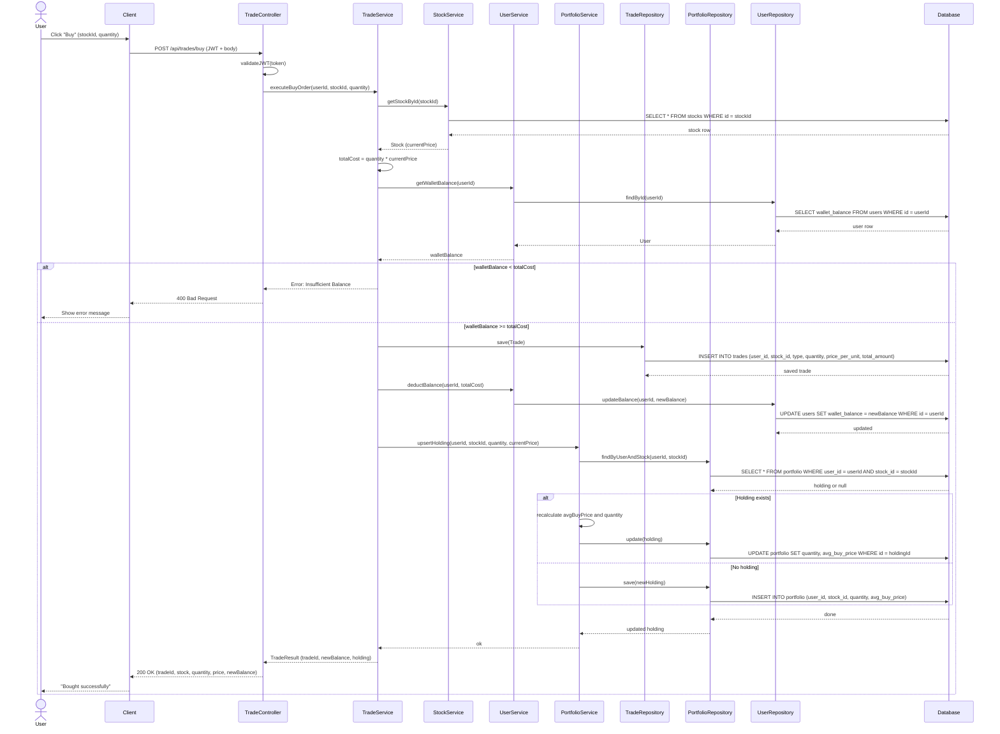

# Sequence Diagram

The most critical backend flow in TradeLearn is when a user buys a stock. This involves JWT auth at the controller, balance + holdings validation in the service layer, a transactional write across three tables (trades, portfolio, users), and a structured response back to the client.

## Alternate Flows

### Alternate Flow 1: Stock Not Found
- **Condition**: Invalid stockId provided
- **Flow**: 
  1. StockService returns null
  2. TradeService throws StockNotFoundException
  3. Controller returns 404 Not Found
  4. User sees "Stock not found" error

### Alternate Flow 2: Insufficient Balance
- **Condition**: User's wallet balance < total cost
- **Flow**:
  1. Validation fails at TradeService
  2. Controller returns 400 Bad Request
  3. User sees "Insufficient balance" error

### Alternate Flow 3: Invalid Quantity
- **Condition**: Quantity <= 0 or not a valid number
- **Flow**:
  1. Frontend validation catches error
  2. If bypassed, TradeService validates
  3. Returns 400 Bad Request
  4. User sees "Invalid quantity" error

### Alternate Flow 4: Market Closed
- **Condition**: Trading outside market hours
- **Flow**:
  1. TradeService checks market status
  2. Returns "Market is closed" error
  3. Trade is not executed

## Key Points

### Transaction Management:
- All database operations (deduct balance, save trade, update portfolio) should be wrapped in a **database transaction**
- If any operation fails, the entire transaction should be rolled back
- Ensures data consistency (ACID properties)

### Concurrency Handling:
- Stock prices may change during transaction
- Use optimistic locking or pessimistic locking
- Capture price at time of validation

### Performance Considerations:
- Multiple database queries can be optimized
- Consider caching stock prices
- Use database indexes on user_id, stock_id

### Security:
- JWT token validation at controller level
- Prevent users from buying stocks for other users
- Sanitize and validate all inputs

---

*This sequence diagram demonstrates the complete interaction flow for a stock purchase, showing proper layering, validation, and data persistence in the TradeLearn platform.*
