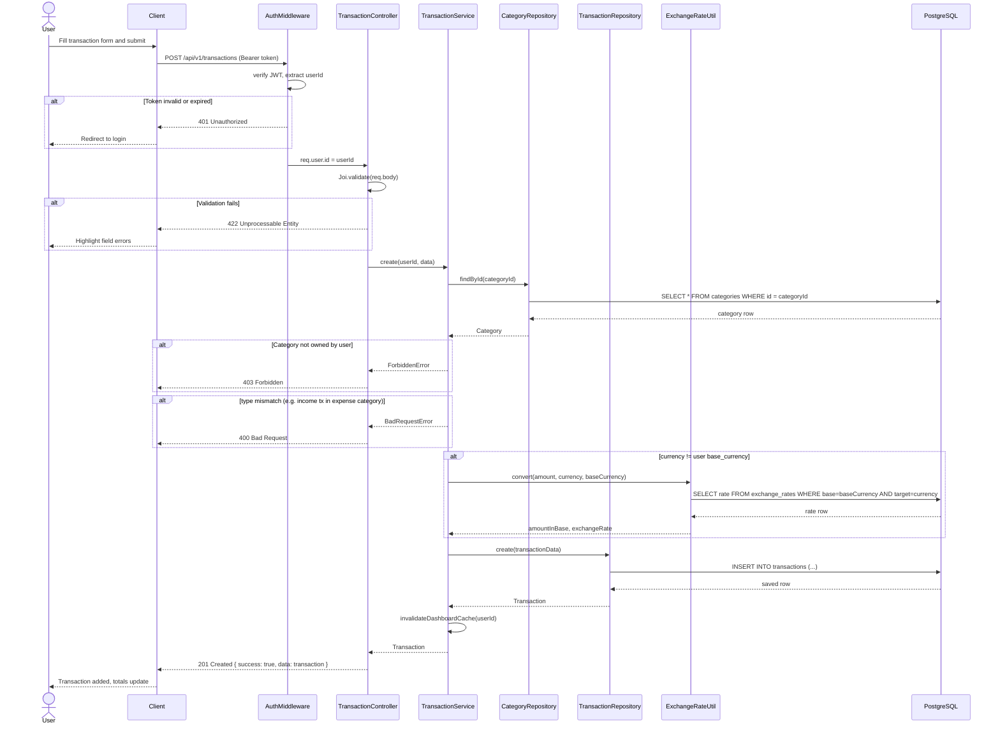
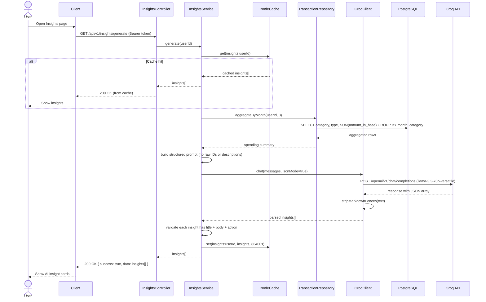
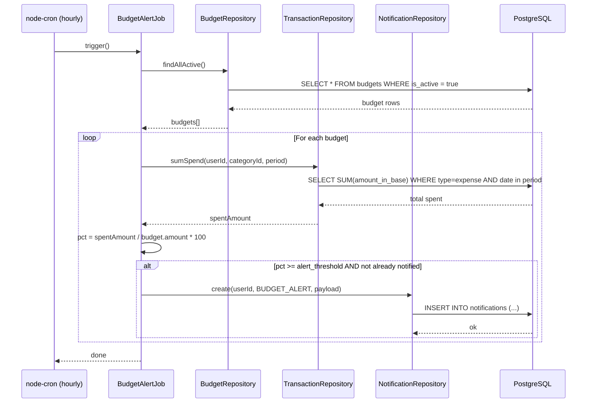

# Sequence Diagrams

Two flows are documented here — creating a transaction (the most common write path) and generating AI insights (the most interesting read path).

---

## Flow 1: Create a Transaction

When a user submits a new transaction, the request goes through JWT auth middleware, Joi validation, an ownership check on the category, an FX conversion if needed, and finally the DB write. On success the dashboard cache is invalidated so the next dashboard load reflects the new data.

---

## Flow 2: Generate AI Insights

The insights endpoint checks the cache first. On a miss it pulls 3 months of aggregated spending from the DB, sends a structured prompt to Groq, parses the JSON response, and caches the result for 24 hours.

---

## Flow 3: Budget Alert (Background Job)

This runs on a node-cron schedule (every hour). It checks all active budgets, computes spend against the limit, and writes a notification for any budget that has crossed its alert threshold since the last check.

