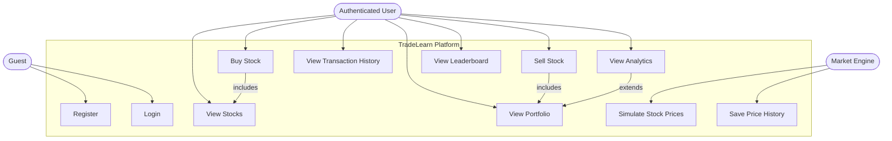

# Use Case Diagram

TradeLearn lets users practice stock trading using virtual money in a simulated market. Users can register, trade stocks, track their portfolio, and view learning analytics — all without any real financial risk. The system also includes an internal market engine that updates stock prices automatically.

## Actors

- **Guest** — Can register or log in to access the platform
- **Authenticated User** — Core actor; can trade, view portfolio, check analytics, and compete on the leaderboard
- **Market Engine (System)** — Internal automated actor; periodically updates stock prices

## Use Cases by Actor

**Guest:**
- Register account
- Login

**Authenticated User:**
- View available stocks and current prices
- Buy stock
- Sell stock
- View transaction history
- View portfolio (holdings, avg buy price, P&L)
- View learning analytics (risk score, diversification, win rate)
- View leaderboard

**Market Engine (System):**
- Simulate and update stock prices
- Save price to history

