# Use Case Diagram

The system has three actors. **Guest** can only register or log in. **User** is the main actor once authenticated — they manage transactions, set budgets, track investments, import bank statements, and interact with the AI features. **System** represents the background jobs that run automatically without user involvement.

## Actors

- **Guest** — unauthenticated visitor; can only register or log in
- **User** — authenticated user; full access to all financial features
- **System** — automated background jobs (cron-based, no user interaction)

## Use Cases by Actor

**Guest:**
- Register with email/password
- Log in
- Sign in with Google OAuth

**User:**
- Add / edit / delete transactions
- Bulk delete or re-categorize transactions
- Manage categories (create, rename, merge, soft delete)
- Set and manage budgets (per-category or overall)
- View budget progress and spend percentages
- View dashboard (health score, recent activity, balance summary)
- View monthly/yearly reports and category breakdowns
- Export transactions as CSV
- Upload receipt and attach to transaction
- Set up recurring transaction rules
- Add / update / delete investments (stock, mutual fund, crypto)
- View investment portfolio with P&L summary
- Import bank statement (CSV or PDF)
- Ask the AI finance assistant questions
- View AI-generated spending insights
- View AI-detected spending anomalies
- Get AI budget recommendations
- Create a savings goal plan with the AI
- View and mark notifications as read
- Update profile and preferences (theme, base currency, notification settings)
- Refresh JWT access token

**System:**
- Run recurring transactions job (daily — create due transactions)
- Run budget alert job (hourly — check thresholds and write notifications)
- Sync exchange rates (periodic FX cache refresh)

```mermaid
flowchart TD
    Guest([Guest])
    User([Authenticated User])
    System([System / Background Jobs])

    subgraph Authentication
        UC1[Register]
        UC2[Login]
        UC3[Google OAuth]
    end

    subgraph Transactions & Categories
        UC4[Add Transaction]
        UC5[Edit / Delete Transaction]
        UC6[Bulk Operations]
        UC7[Manage Categories]
        UC8[Merge Categories]
        UC9[Import Bank Statement]
        UC10[Upload Receipt]
    end

    subgraph Budgets & Reports
        UC11[Set Budget]
        UC12[View Budget Progress]
        UC13[View Reports]
        UC14[Export CSV]
        UC15[Set Recurring Rule]
    end

    subgraph Investments
        UC16[Add Investment]
        UC17[View Portfolio and PnL]
    end

    subgraph AI Features
        UC18[AI Chat Assistant]
        UC19[Generate Insights]
        UC20[Detect Anomalies]
        UC21[Budget Recommendations]
        UC22[Savings Goal Planner]
    end

    subgraph Background Jobs
        UC23[Process Recurring Transactions]
        UC24[Check Budget Thresholds]
        UC25[Refresh Exchange Rates]
    end

    Guest --> UC1
    Guest --> UC2
    Guest --> UC3

    User --> UC4
    User --> UC5
    User --> UC6
    User --> UC7
    User --> UC8
    User --> UC9
    User --> UC10
    User --> UC11
    User --> UC12
    User --> UC13
    User --> UC14
    User --> UC15
    User --> UC16
    User --> UC17
    User --> UC18
    User --> UC19
    User --> UC20
    User --> UC21
    User --> UC22

    System --> UC23
    System --> UC24
    System --> UC25

    UC9 -.->|includes| UC4
    UC12 -.->|extends| UC11
    UC20 -.->|extends| UC19
    UC24 -.->|triggers| UC12
```

